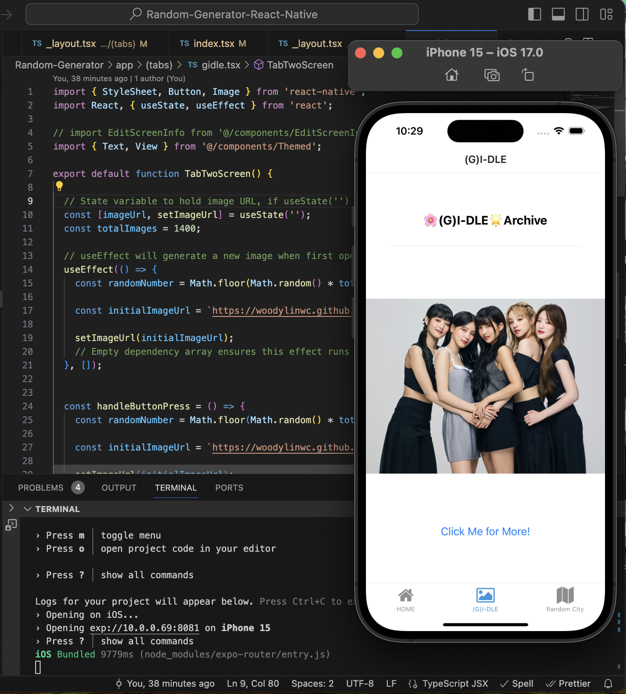

# Random-Generator-React-Native

A intuitive and fun project that helps you understand a little bit about React Router and React Hooks (useState, useEffect) by showing you three ways of getting and displaying data.

1. Online API (Unsplash API)
2. Local JSON file (cityData.json)
3. GitHub Page (My GitHub image storage)




# How to run this project locally
Fork my repo and give it a shot!
```
cd Random-Generator
npm install
npx expo start
```


Expo with router
```
npx create-expo-app@latest --template tabs@50
cd Random-Generator
npx expo start
```

useState and useEffect, react hook

If you don't use a state variable to hold the image URL, the image won't be able to dynamically change based on user interaction or any other events. Instead, the image will be static and remain the same throughout the component's lifecycle.


go to https://unsplash.com/developers to request FREE API